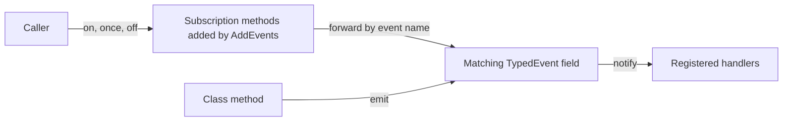

# ts-events Architecture Overview

## Scope

`@webex/ts-events` is a small library for adding type-safe events to TypeScript classes. Callers subscribe by event name with `on`, `once`, or `off`, and TypeScript checks that each handler accepts the correct arguments. Parent and child classes can each define their own events, while the class remains responsible for emitting them.

The package exports three symbols from `src/index.ts`:

- `TypedEvent`: owns listeners for one typed handler signature and exposes `on`, `once`, `off`, and `emit`.
- `AddEvents`: extends a class with named `on`, `once`, and `off` methods that delegate to matching `TypedEvent` members.
- `WithEventsDummyType`: describes the subscription methods so an exported class can also be referenced as a type.

## Event model



An event map lists the available event names and the arguments accepted by their handlers. The class stores each event in a `TypedEvent` field with the same name. `AddEvents` adds the public subscription methods and forwards each call to the matching field.

`AddEvents` does not expose an `emit` method. Callers can subscribe to events, but the class decides which methods emit them. Keeping the `TypedEvent` fields protected or private prevents callers from emitting events directly through the TypeScript API. This is compile-time encapsulation, not a runtime permission check.

## Inheritance and type composition

Each class level can define its own event map and apply `AddEvents`. A child extends the parent class returned by `AddEvents`, then applies `AddEvents` again for its own events. TypeScript combines the inherited subscription overloads, allowing an instance to subscribe to parent and child event names.

The established export pattern has separate value and type declarations:

```typescript
export const Parent = AddEvents<typeof _Parent, ParentEvents>(_Parent);
export type Parent = _Parent & WithEventsDummyType<ParentEvents>;
```

The event-map keys and class field names must match. The generic parameter for the event map is not fully constrained by the type system, so reviewers must verify this relationship and retain compile-time tests when changing composition.

## Listener lifecycle

`TypedEvent` wraps one internal `EventEmitter` channel:

- `on` registers a persistent handler.
- `once` registers a handler for at most one emission.
- `off` removes the same handler reference previously registered.
- `emit` forwards arguments constrained by the handler parameter types.

The mixed methods delegate to these operations. The package does not expose the rest of the Node `EventEmitter` API.

## Direct runtime dependencies

| Dependency | Architectural role |
|---|---|
| [`events`](https://www.npmjs.com/package/events) | Supplies the runtime listener implementation used inside `TypedEvent` |
| [`typed-emitter`](https://www.npmjs.com/package/typed-emitter) | Supplies type definitions that bind the internal emitter channel to a handler signature |

`package.json` is authoritative for the complete dependency list and current version ranges.

## Browser and package boundaries

Rollup starts from `src/index.ts` and produces ESM, CommonJS, UMD, minified UMD, and declaration outputs described by `package.json`. The browser build resolves `events` through `rollup-plugin-polyfill-node` and uses browser-aware module resolution.

Jest runs source tests in jsdom rather than a real browser. See [AGENTS.md](../../../AGENTS.md) for current test commands and limitations.

## Implementation entry points

| Path | Role |
|---|---|
| `src/index.ts` | Defines the public exports |
| `src/typed-event.ts` | Implements typed listeners and event emission |
| `src/event-mixin.ts` | Adds typed subscription methods to classes |

## Release behavior

Pull requests run lint and Jest coverage checks in GitHub Actions. Pushes to `main` build the package and run semantic-release.

semantic-release analyzes Conventional Commits, generates release notes and the changelog, publishes the public npm package, and commits configured release assets. Changes to public exports, handler signatures, package entry points, declarations, or runtime behavior need an explicit compatibility assessment before merge.
